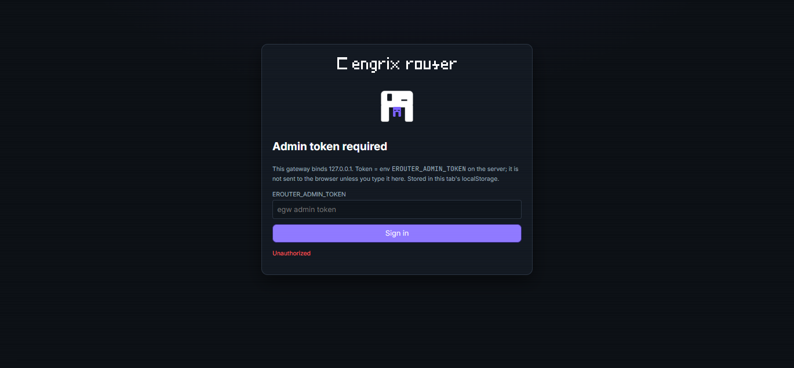
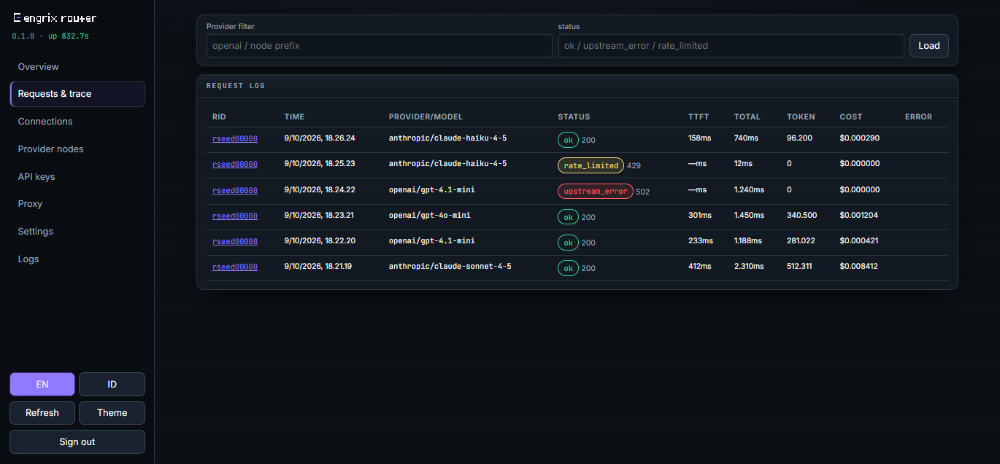
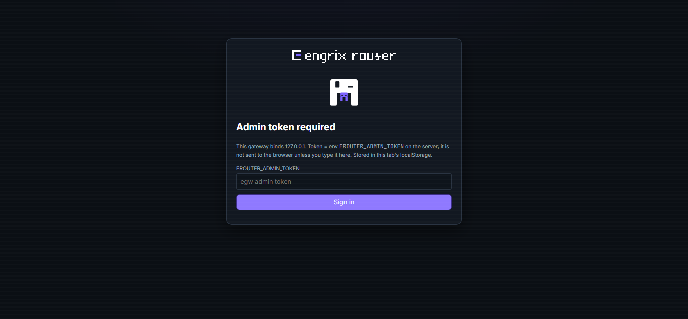

<picture>
  <source media="(prefers-color-scheme: dark)" srcset="src/engrix_router/web/static/assets/engrix-lockup-router-dark-animated.svg" width="360">
  
</picture>

# engrix-router


**Unofficial client. Not affiliated with any vendor. Subscription-backed providers may break
at any time and may violate the vendor's terms of service; you use them at your own risk.**
This wording is required by [ADR-0002](docs/adr/0002-public-core-private-providers.md) and is
repeated in [SECURITY.md](SECURITY.md).

A local OpenAI- and Anthropic-compatible API gateway (FastAPI + SQLite) for agent loops, SDKs
and scripts. A client points at this gateway instead of at a vendor, sends an OpenAI-shaped or
Anthropic-shaped request, and gets back what it expects -- with multi-account rotation,
connection health, daily budgets, cost accounting, vendor quota readings, proxy pools,
per-request trace and an operator dashboard on top.

The gateway is a translator. It never changes the meaning of a request: no prompt injection,
no guardrails, no response cache that rewrites answers, no reinterpretation of the parameters
the client sent ([ADR-0000](docs/adr/0000-philosophy-and-boundaries.md)). Config comes from the
client, and the client must not be able to tell it talks to a gateway.

The behaviour was ported from a reference implementation (9router v0.5.95) whose measured
defects this build does not reproduce. The porting map and the deliberate deviations are in
[docs/ARCHITECTURE.md](docs/ARCHITECTURE.md). Read `docs/adr/` first -- start with 0000.

## Dashboard

Dark theme by default (the brand's primary is the dark theme), a light toggle, EN/ID
locale switch, and the operator page is one FastAPI-served file -- no JS build step.
The screenshots below run against a scratch database with fabricated rows: no real
traffic and no vendor data in them.





The sign-in gate is standalone until a token is entered; the admin token lives in
`localStorage` of that tab and is never sent anywhere except this gateway's `/api/*`.
Without `EROUTER_ADMIN_TOKEN` set on the server, every admin route answers 503.



## What is proven, and what is not

* `python -m pytest -q` -> **100 tests, all offline** (httpx is stubbed; no vendor call, no
  credit spent). It covers the shared provider contract suite, the Anthropic translation in
  both directions, provider discovery from outside the package, schema migrations, the layer
  map, the language policy and the private-material guard.
* `python scripts/verify_slice.py` -> **39/39 checks** on the vertical slice with the upstream
  stubbed: public `/health`, admin fail-closed, hashed client keys, SSRF guard, node and
  connection CRUD, zero-cost probe, streaming and non-streaming chat, `usage` reaching the
  client without inflation, the five trace stages with redacted headers, the daily rollup,
  budget and rate-limit denial *before* any upstream call, vendor cost signals reaching the
  ledger, dry run, the error taxonomy (an unknown model is a 404, never a 403), account locks
  and router skipping, reset-on-activation, proxy userinfo rejection, the protocol-drift freeze
  and its clear, both inbound formats, and clean provider discovery. Evidence artifact:
  `data/verify_slice.json`.
* **Not proven in this repository:** anything that needs a real vendor. This tree ships no
  subscription adapter, so no live vendor call has ever been made from it, and
  [`.github/workflows/ci.yml`](.github/workflows/ci.yml) is offline on purpose. Live checks
  belong to the adapter distribution that owns the credentials.

## Install and run

The package uses a `src/` layout (`engrix_router`), so there are two ways to start it:

```bash
# 1. installed (the real way)
pip install -e .[dev]
export EROUTER_ADMIN_TOKEN=<your admin token>     # Windows: set EROUTER_ADMIN_TOKEN=...
engrix-router                                     # entry point, default http://127.0.0.1:8450

# 2. from a checkout, no install
export PYTHONPATH=src
python -m engrix_router.web.server
```

Scripts under `scripts/` insert `src/` into `sys.path` themselves, so they run either way. On a
Windows console with a legacy code page, prefix commands with `PYTHONIOENCODING=utf-8`: the gateway
writes non-ASCII to stdout.

* Schema only: `python scripts/bootstrap_db.py` (`--force` re-stamps a comment-only DDL change;
  a real column change needs a `SCHEMA_VERSION` bump plus a `MIGRATIONS` entry in
  `src/engrix_router/storage/sqlite.py`).
* Container: [`deploy/`](deploy/README.md) (`Dockerfile`, `docker-compose.yml`).
* Python 3.11+.

**Configuration.** Copy [`.env.example`](.env.example) to `.env` (gitignored, loaded at startup
by `python-dotenv`); it documents every variable with its real default.
[`config.example.yaml`](config.example.yaml) is documentation only -- **no loader reads it yet**.
Values an operator changes without a restart do not live in env at all: they live in the
`settings` table (dashboard **Settings** tab, or `PATCH /api/settings`). One value, one place.

## Dashboard and the admin token

Dashboard: `http://127.0.0.1:8450/`. It asks for the admin token once and keeps it in
`localStorage`; every `/api/*` call still needs the token as `Authorization: Bearer` or
`X-Admin-Token`. OpenAPI docs: `/api/docs`.

`EROUTER_ADMIN_TOKEN` has **no default**. Empty means every `/api/*` route answers
`503 Admin API locked` -- fail-closed, not a hardcoded fallback -- and startup logs a warning.

`/v1/*` requires a gateway client key (`EROUTER_REQUIRE_CLIENT_KEY=true` by default, and
loopback does not get a free pass). Create one:

```bash
curl -s -H "authorization: Bearer $EROUTER_ADMIN_TOKEN" -H content-type:application/json \
  -X POST http://127.0.0.1:8450/api/keys -d '{"name":"my-agent"}'
# -> {"id": "...", "key": "egk-live-...", "key_prefix": "egk-live-...", ...}
```

The secret is returned exactly once and is stored as a SHA-256 hash plus a display prefix;
`GET /api/keys` never gives it back.

## First run without a vendor account

The full pipeline can be exercised with no upstream credential at all. Start the server in
dry-run mode, register one dummy connection (upstream is never called, so the key can be
anything), and every `/v1/*` request is built, traced and accounted, then answered
synthetically:

```bash
export EROUTER_DRY_RUN=true
python -m engrix_router.web.server            # or: engrix-router

curl -s -H "authorization: Bearer $EROUTER_ADMIN_TOKEN" -H content-type:application/json   -X POST http://127.0.0.1:8450/api/connections   -d '{"provider":"openai","name":"dummy","auth_type":"apikey","api_key":"sk-nothing","probe":false}'

curl -s http://127.0.0.1:8450/v1/chat/completions   -H "authorization: Bearer <gateway client key>" -H content-type:application/json   -d '{"model":"openai/gpt-4o-mini","messages":[{"role":"user","content":"reply with OK"}]}'
# -> {..., "engrix_dry_run": true}
```

The request appears in the dashboard's **Requests & trace** with a `dry_run` badge and its
five pipeline stages attached. `EROUTER_DRY_RUN` is read at startup; leave it unset for real
traffic.

## Two inbound formats, one pipeline

Both surfaces run the same admission, routing, retry, trace and accounting path, and both are
rendered from one canonical frame stream (`pipeline/runner.py: stream_frames(..., render=...)`)
-- that is [ADR-0001](docs/adr/0001-canonical-format.md) "one pipeline, N wire formats".
On `/v1/chat/completions` a model is always `provider/model`: a bare or unknown prefix is a `404`,
never a guess.

OpenAI:

```bash
curl -s http://127.0.0.1:8450/v1/chat/completions \
  -H "authorization: Bearer <gateway client key>" -H content-type:application/json \
  -d '{"model":"openai/gpt-4o-mini","messages":[{"role":"user","content":"reply with OK"}],"stream":false}'
```

Anthropic (`POST /v1/messages`; a bare `model` gets the `anthropic/` prefix, a prefixed id is
respected, and streaming is answered as Anthropic events -- `message_start`,
`content_block_start` / `content_block_delta` / `content_block_stop`, `message_delta`,
`message_stop`, with an `error` event and no `[DONE]` sentinel):

```bash
curl -s http://127.0.0.1:8450/v1/messages \
  -H "x-api-key: <gateway client key>" -H content-type:application/json \
  -d '{"model":"claude-sonnet-4-5","max_tokens":64,"messages":[{"role":"user","content":"reply with OK"}]}'
```

Either example needs a connection holding an upstream credential for that provider:
`POST /api/connections`, which also runs the zero-token probe (send `"probe": false` to skip
it). The model catalogue the client sees comes from the upstream's own list, cached per
connection: `GET /api/connections/{id}/models?force=true`.

## Adding a provider

**One file in `src/engrix_router/providers/`** -- copy `_template.py` -- plus one contract test
class. The full guide, including the base hooks and the debug path, is
[docs/ADDING_A_PROVIDER.md](docs/ADDING_A_PROVIDER.md).

Built-in providers today:

| file | what it is |
|---|---|
| `providers/openai.py` | the generic OpenAI-shaped upstream; also serves runtime `nodes` rows (operator-defined prefixes, no code written) |
| `providers/anthropic.py` | Anthropic-compatible upstream: `x-api-key` + `anthropic-version`, mandatory `max_tokens` default, typed event-stream decoding |
| `providers/_template.py` | the copy-me starting point; not routable, because the scanner skips names starting with `_` |

## Attaching a provider shipped outside this repository

`providers/registry.py` scans three sources and never a hand-edited import list:

1. built-in modules **and** packages under `engrix_router/providers/`;
2. installed distributions publishing an entry point in the group `engrix_router.providers`;
3. `EROUTER_PROVIDERS_PATH`, an `os.pathsep`-separated directory list, for running an external
   adapter straight from a checkout without building a wheel.

Every source declares the same two module attributes: `DEFINITIONS` (the vendor definitions)
and the optional `PROVIDER_CLASS` (defaults to `OpenAICompatibleProvider`).

Failure handling is loud, because a silently missing provider is the bug class this repo exists
to kill:

* a source that fails to import is isolated per source -- the others keep routing -- recorded by
  `registry.load_errors()`, surfaced by `GET /health` as `providers_failed`, and logged at
  startup;
* two sources claiming one model prefix raise `DuplicatePrefix` at startup instead of letting
  one shadow the other.

One private distribution, `engrix-router-providers` (ADR-0002), holds every
reverse-engineered subscription adapter -- one module or folder per
vendor, not one repository per vendor, because discovery takes a list and separate repos would
only multiply the CI and the version pins. Such an adapter attaches through mechanism 2 or 3 and
registers its own runtime knobs itself, through `settings.register_defaults({...}, owner="<vendor>")`,
so the public `DEFAULTS` registry stays free of vendor keys. Its reverse-engineered wire material
stays with it, and
[tests/test_no_private_material.py](tests/test_no_private_material.py) keeps it out of this repo.

## Environment

Every variable read in `src/engrix_router/core/config.py`. All optional unless noted.

| variable | default | purpose |
|---|---|---|
| `EROUTER_DATA_DIR` | `<repo>/data` | where the process writes: database, logs, verification artifacts |
| `EROUTER_DB_PATH` | `<data>/engrix_router.sqlite3` | SQLite file (WAL). Holds upstream tokens in plaintext today |
| `EROUTER_LOG_DIR` | `<data>/logs` | created at startup; console sink, plus the rotating file sink when `EROUTER_LOG_FILE=true` |
| `EROUTER_CREDENTIALS_DIR` | `<repo>/credentials` | created at startup, gitignored; where an external adapter's credential file is expected. Nothing in the core reads it yet |
| `EROUTER_PROVIDERS_PATH` | empty | extra provider directories (path list, `os.pathsep`-separated) |
| `EROUTER_HOST` | `127.0.0.1` | bind address. Keep loopback: the gateway holds tokens and spends quota |
| `EROUTER_PORT` | `8450` | bind port |
| `EROUTER_CORS_ORIGINS` | empty | comma-separated origins; the CORS middleware is only added when non-empty |
| `EROUTER_ADMIN_TOKEN` | empty | **required for `/api/*`.** Empty = fail-closed `503` on every admin route |
| `EROUTER_REQUIRE_CLIENT_KEY` | `true` | gate for `/v1/*`. `false` = open (localhost-only thinking) |
| `EROUTER_MAX_REQUEST_BYTES` | `6291456` (6 MiB) | rejected before parsing, so an oversized body costs no vendor call |
| `EROUTER_MAX_STAGE_BYTES` | `65536` (64 KiB) | **read into config but not consumed**: the live knob is the setting `observability.max_stage_bytes` |
| `EROUTER_UPSTREAM_CONNECT_TIMEOUT_S` | `20` | upstream connect deadline |
| `EROUTER_UPSTREAM_FIRST_CHUNK_TIMEOUT_S` | `25` | time-to-first-token cap -- deliberately below a typical client's 30 s round deadline |
| `EROUTER_UPSTREAM_STALL_TIMEOUT_S` | `120` | watchdog between SSE lines |
| `EROUTER_UPSTREAM_TOTAL_TIMEOUT_S` | `300` | hard cap per attempt and the budget of the whole failover loop |
| `EROUTER_LOG_LEVEL` | `info` | console level; error lines bypass level gating in the ring |
| `EROUTER_LOG_RING_SIZE` | `2000` | in-memory ring served by `GET /api/logs` and `/api/logs/stream` |
| `EROUTER_LOG_FILE` | `true` | rotating file sink (`engrix-router.log`) in `EROUTER_LOG_DIR`; `false` = console only |
| `EROUTER_LOG_FILE_MAX_BYTES` | `5242880` | max size per log file before rotation |
| `EROUTER_LOG_FILE_BACKUPS` | `3` | rotated log files kept (`.1`, `.2`, ...) |
| `EROUTER_REDACT_HEADERS` | a built-in list | header names redacted on every log and trace path; the full default list is in `.env.example`. Only add names |
| `EROUTER_DRY_RUN` | `false` | **implemented**: resolve, admission, routing, `build_request` and trace all run, the upstream is never called, a `dry_run` stage (step 6) is written, the trace row finishes with status `dry_run`, the budget reservation settles to 0, and the JSON answer carries `"engrix_dry_run": true` |
| `EROUTER_TEST_MODE` | `false` | **read into config but not consumed**; the test suite sets its env directly in `tests/conftest.py` |

Two more are read outside `core/config.py`, in `src/engrix_router/transport/proxy.py`:
`EROUTER_PROXY_TEST_URL` (target of the proxy-pool probe) and `EROUTER_PROXY_<NAME>` -- a
template, not a literal variable: one env entry per proxy credential, referenced by name from
the `credential_hint` column. Proxy URLs with userinfo are rejected, and credentials never
enter the database or the API.

## Repository governance

* [LICENSE](LICENSE) -- Apache-2.0.
* [SECURITY.md](SECURITY.md) -- what the gateway holds, and the private reporting channel.
* [CONTRIBUTING.md](CONTRIBUTING.md) -- setup, the boundaries a PR has to respect.
* [CHANGELOG.md](CHANGELOG.md) -- state of the tree per release.
* [docs/adr/](docs/adr) -- 0000 philosophy and boundaries, 0001 canonical format,
  0002 public core / private providers, 0003 layer map, 0004 file naming.
* [`.pre-commit-config.yaml`](.pre-commit-config.yaml) and
  [`.github/workflows/ci.yml`](.github/workflows/ci.yml) -- the guards that run.
* [deploy/](deploy/README.md) -- container files and the exposure rules.

**Language policy** ([ADR-0000](docs/adr/0000-philosophy-and-boundaries.md)): every public
surface is English -- identifiers, docstrings, log lines, client-visible errors, UI strings,
this documentation. `#` comments inside code are Indonesian, because the owner maintains the
code. A test enforces both, so this is a rule and not a preference.

## Not built yet / known gaps

Honest list, so nobody is surprised:

* **`connections.cred_json` is plaintext** in the local SQLite file. No encryption at rest;
  treat the data directory as a secret.
* **PAT-style auth flows live in adapters and are unverified here.** No token-refresh service is
  implemented, on purpose: no provider in this codebase has a verified refresh call, and writing
  one would mean inventing a request shape. Account rotation stays manual until a vendor
  endpoint is measured.
* **No periodic health prober, on purpose.** The connection breaker already learns health from
  real traffic; a probe that spends credits duplicates that signal at a cost. The zero-credit
  probe exists: `POST /api/connections/{id}/test`.
* **No migration tooling** beyond the in-code `MIGRATIONS` list in
  `src/engrix_router/storage/sqlite.py` (schema v1 -> v2 proves it works, idempotently, and an
  older build refuses a newer database). A DDL change still needs a human to write the entry.
* **Cost accounting is wired but narrow**: `billable` / `credits` / `credits_original` come out
  of any vendor usage block and land in the `requests` row; USD cost needs a price entry
  (`pricing.overrides`), and an unknown model reports "no price" rather than `$0.00`.
* **Runtime `nodes` are OpenAI-shaped only.** The `type` column accepts
  `anthropic-compatible` and `custom-embedding`, and the value is recorded, but nothing
  dispatches on it: a node is always served by `OpenAICompatibleProvider`. `api_type` maps
  `chat` -> `/chat/completions`, anything else -> `/responses`; embeddings are not implemented.
* **`TransportSpec` has no `requires_stream` / `validate_url` flags.** They were declared and read by nothing, so they were removed: a field on the central contract that nothing honours is a fake gate. A stream-only upstream simply aggregates in its own `complete()`.
* **Multi-modal inbound is unverified.** Unknown `content` blocks are passed through untouched
  rather than dropped, but no image path has been measured from this repository and no
  base64-image translation is implemented. Do not trust image traffic through the gateway yet.
* **`routing/topology/`, `ml/` and `docs/providers/` do not exist and are not designed yet.**
  They are not architecture; do not treat a name drop as a plan.
* **Linting is advisory.** `ruff` is the intended linter but the tree is not clean under it, so
  CI runs it without gating and pre-commit keeps it on a manual stage.
